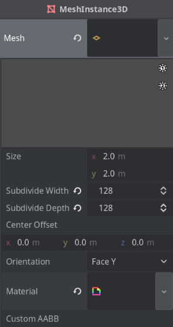
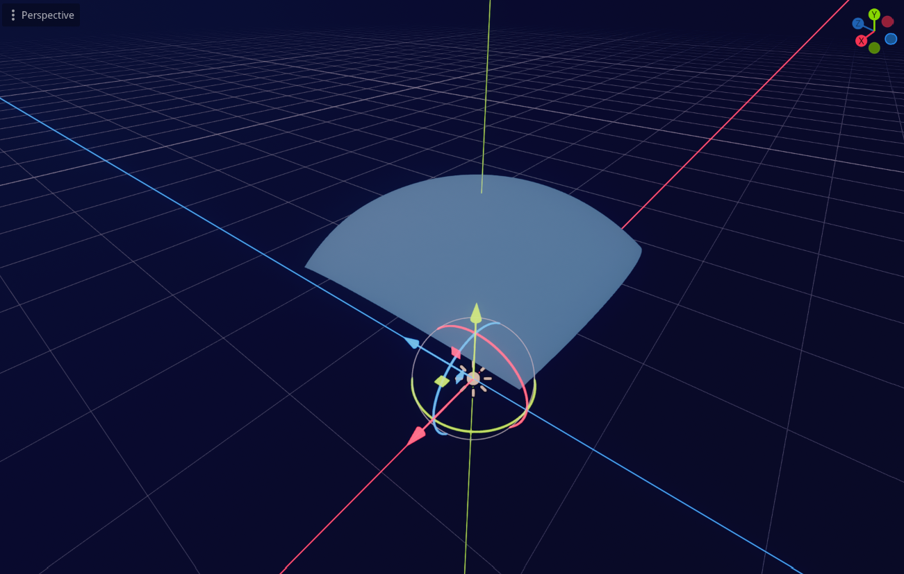
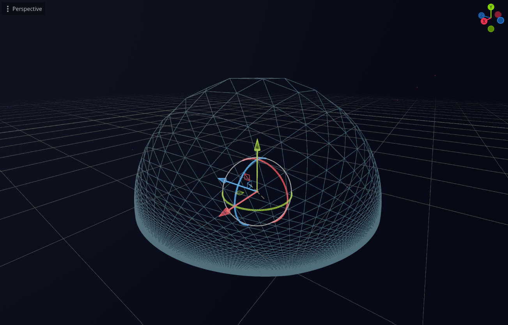
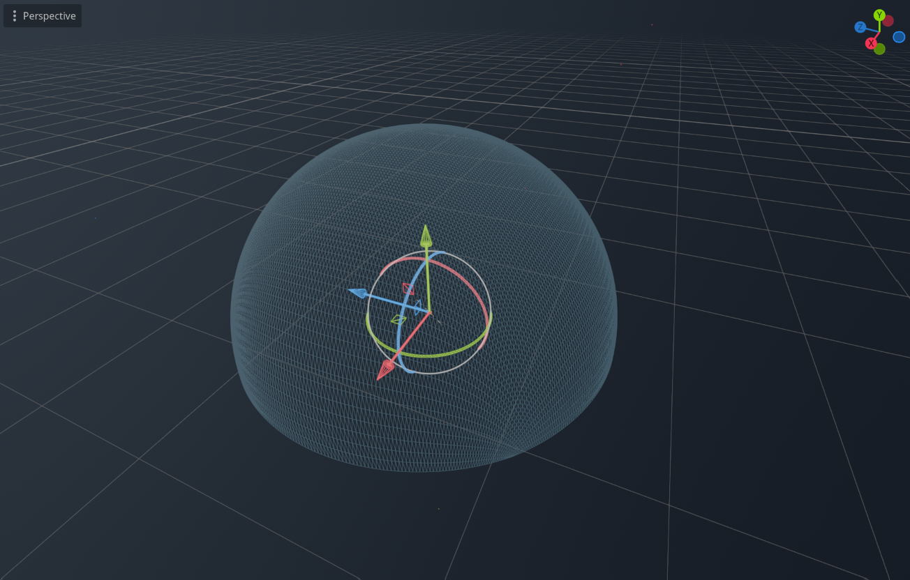
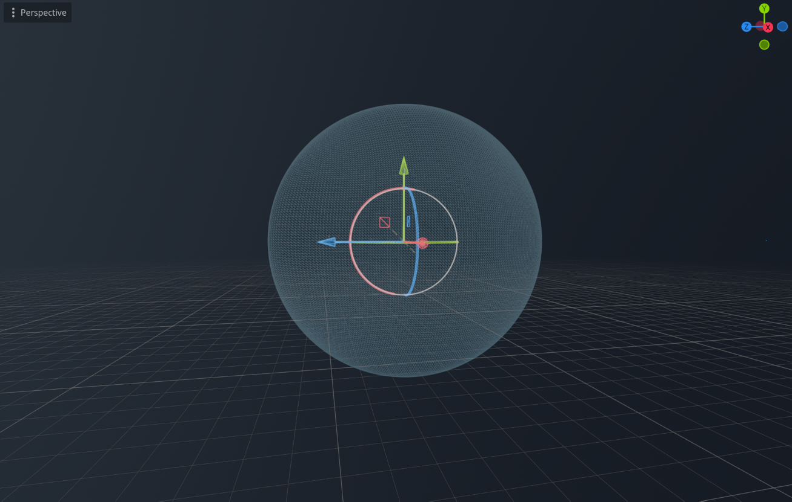
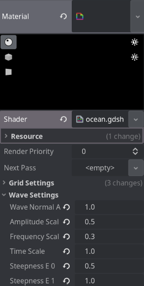
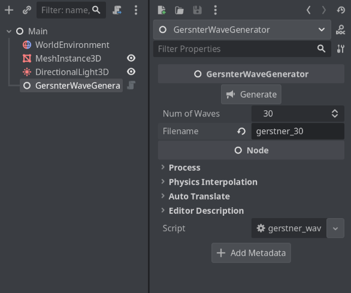
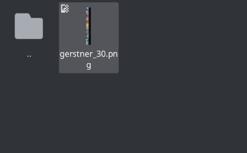
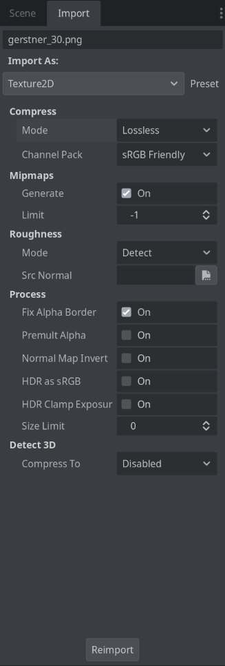
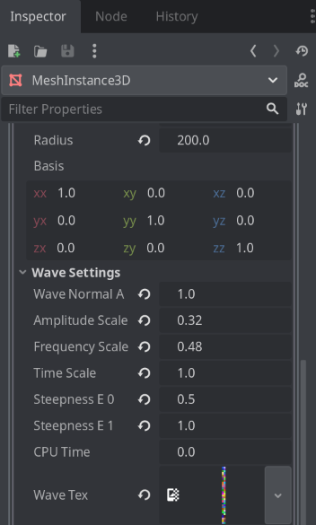

+++
title = "Spherical Gerstner Wave: Vertex Shader"
date = 2025-09-03T18:09:51+02:00
summary = "Ocean waves simulation on spherical surfaces in Godot Engine 4"
readingTime = true
tags = ["godot", "computer-graphics"]
toc = true
+++

## What is This?

I spent a few days trying to figure out how to properly simulate ocean waves for spherical levels in video games. I managed to do it for flat surfaces thanks to <cite>Catlike Coding's awesome walkthrough of the Gerstner Wave [^1]</cite>, but trying to project a flat plane onto a sphere and making the waves work like before is a different problem, one that I could not solve on my own.

So I thought there has to be someone smarter than me who had solved this issue before, knowing that we've had games that features planets with oceans, right? (Looking at you, Giant's Deep in Outer Wilds.) And well, I stumbled upon a paper called <cite>_Real-Time Rendering of Procedurally Generated Planets_ [^2]</cite>, written by Florian Michelic and Michael Kenzel which explains how to deal with this exact problem! Usually I'd steer clear from scientific papers because they can be rather difficult to comprehend, but honestly it's hard to do that when you're working on computer graphics stuff. So, driven by my curiosity, I managed to implement their method in my game engine of choice, namely Godot Engine 4, and actually had a pretty good time reading the paper as I think it was really well written! I also received great help from <cite>kulesz's PlanetaryWater repository [^3]</cite>, which is also an implementation of the method, but in Unity.

I'm quite satisfied with the result (you can see in the video below); the method they came up with produces waves that are distortion-free, meaning it will look good regardless of where you are, whether you're looking from a certain point on the planet or from the space, and it works wonders with large amount of waves (more detailed) or small amount of waves (more simple, which is what I'm after.)

I used 20 waves in the video, in which you can play around with the plane size and the radius. You can also tweak the amplitude, frequency, and time scale of the waves. It is also possible to change the orientation of the plane using the basis uniform.

The repository of this project can be found [here](https://github.com/mharitsnf/godot-spherical-gerstner-waves).

---

## Setting Up the Scene
Let's get started! As I mentioned, I'm using Godot Engine 4, but you should be able to replicate this in any other engine. At the end of this article, you'll have a spherical gerstner wave implementation in the vertex shader.

Note that I'm not doing the frament shader for now mainly because I'm lazy, and also I haven't got a good art direction for my ocean. I'll come back to that in a future article.

Firstly, let's create a `MeshInstance3D` node that would be our main visual, which will hold our shader material as well. We want a PlaneMesh for the mesh, and set the size to 2 on both the width and height. This way we can ensure that the bottom left corner of the plane will fall on the coordinates (-1, -1), while the top right corner of the plane will fall on the coordinate (1, 1). This is necessary for the grid projection calculation that we will be doing in the next section.


We also want to set the subdivide width and depth to a number we like. I'm setting both the width and depth to 128, as I think it's a good spot for the fidelity I'm after. You can crank it up to 256 or 512 to make it even more hi-fi, or lower it to 64 to make it more lo-fi. Just remember, the higher the number, the slower it becomes as the number of vertices the shader will need to operate will also increase.

Now, let's create a spatial shader file (I call mine `ocean.shader`), and save it somewhere in the project (I put mine in the root of the project). After that, let's also create a material based on that shader called `m_ocean.tres`, and then assign it to the plane:



---

## Projection Calculation

Let's start with the basic projection method. The basic projection method (that is not distortion-free) involves raising the plane (increasing the Y position of the plane), normalizing the vertices so that we would project the vertices onto a unit sphere, and then multiplying that value with our desired planet radius. Let's add new uniform variables in the shader called `y_offset` and `radius`, and then do the calculation:

```glsl
shader_type spatial;

uniform float y_offset = 100.;
uniform float radius = 1000.;

void vertex() {
    vec3 init_vertex = VERTEX;
    init_vertex.y = y_offset;
    VERTEX = normalize(init_vertex) * radius;
}
```

This is how it looks like with `y_offset` equals to `1.5` and `radius` equals to `100.0`:




It looks okay, but you can see the distortion problem when you set the `y_offset` value to something close to `0.0` (which transforms the plane into a hemisphere), and change the view mode to wireframe mode:



The vertices are concentrated on the bottom part, leaving the top part with very few vertices for us to operate on. On top of that, if you decrease the `y_offset` value to lower than `0.0`, the plane will wrap its back onto the other way of the planet.

The projection method proposed in the paper involves adding an extra calculation on the `init_vertex.y` so that it transforms the plane into something resembling a dome using the `pow(x,y)` function, before finally adding the `y_offset` value onto `init_vertex.y` again:

```glsl
...
uniform float y_exponent = 4.0;
...

void vertex() {
    vec3 init_vertex = VERTEX;
    init_vertex.y = (1. - pow(abs(init_vertex.x), y_exponent)) * (1. - pow(abs(init_vertex.z), y_exponent));
    vec3 offset = vec3(0., y_offset, 0.);
    VERTEX = normalize(init_vertex) * radius;
}
```

This is how it looks like with the same value, where `y_offset` equals to `1.5` and `radius` equals to `100.0`:



As you can see, the distortion is no longer there. We can keep the `y_exponent` value to `4.0` as we have right now, but you can tweak that around. The paper mentions that setting the `y_exponent` value to `2.0` also works pretty good, but overall `4.0` looks the best.

Technically, we are done with the projection. But, while we're at it, lets add a new uniform called `basis`:

```glsl
...
uniform float y_offset = 100.;
uniform float radius = 1000.;
uniform mat3 basis;
...
```
And apply the `basis` to the projection calculation:

```glsl
...
    vec3 init_vertex = VERTEX;
    init_vertex.y = (1. - pow(abs(init_vertex.x), y_exponent)) * (1. - pow(abs(init_vertex.z), y_exponent));
    vec3 rotated_vertex = basis * init_vertex;
    vec3 rotated_offset = basis * vec3(0., y_offset, 0.);
    vec3 grid = normalize(rotated_offset + rotated_vertex) * radius;
    VERTEX = grid;
...
```
Now, we can use update this `basis` uniform when we want to rotate the plane. For example, this is the result when I change the basis to `(0.0, 1.0, 0.0), (-1.0, 0.0, 0.0), (0.0, 0.0, 1.0)`, which essentially making the plane to face right instead of up:



By playing around with the `y_offset` and updating the `basis` accordingly, we can create the effect of having the planet covered in water when we look at it from the space by setting the `y_offset` to something close to `0.0`, whereas when we get closer to the planet surface, we can increase the value to something like `1.5` so that the ocean plane would shrink, only to cover the necessary area around the camera.

Cool! Now let's continue to the Gerstner wave calculation.

---
## Gerstner Wave Calculation

Firstly, we need to set up all the necessary variables for the Gerstner function first. Let's add a few uniform variables and those variables in the vertex shader:

```glsl
void vertex() {
	...
	
	vec3 position_os = grid;
	vec3 position_os_norm = normalize(position_os);

	float sin_part = 0.;
	vec3 cos_part = vec3(0.);

	float sin_part_normal = 0.;
	vec3 cos_part_normal = vec3(0.);

	vec3 tangent = vec3(0.);
}

```

Now, let's start setting up the `spherical_gerstner_wave` function just above the `vertex` function by defining the variables first:

```glsl
void spherical_gerstner(
	vec4 wave_data, vec3 wave_dir, vec3 pos_os_norm,
	inout float sin_part, inout vec3 cos_part,
	inout float sin_part_normal, inout vec3 cos_part_normal, inout vec3 tangent,
	float amp_scale, float s_e0, float s_e1, float freq_scale, float t, float r, float time
) {

}
```

Heh, I'm sure there are better ways to set this up, but I put lots of variables in this function so that I can move this function to a separate include file later. But anyways, let's breakdown the variables here:

1. `vec4 wave_data` contains four `float` values, which represents the amplitude, steepness, frequency, and wave speed;
2. `vec3 wave_dir` describes the wave direction (or more precisely where does this wave starts from);
3. `vec3 pos_os_norm` describes the normalized vertex position;
4. `inout float sin_part` and `inout vec3 cos_part` will be the input and output of the sum of sine part and the cosine part of the Gerstner wave calculation for the vertex respectively;
5. Similarly, `inout float sin_part_normal` and `inout vec3 cos_part_normal` will be the input and output of the sum of sine part and the cosine part of the Gerstner wave calculation for the normal vector respectively;
6. `inout vec3 tangent` will be the input and output for the tangent vector of the vertex (which we don't really need in the shader calculation, but let's just keep it here for now); and,
7. The rest of the variables are the values passed from our uniform variables.

Before we continue, here's a snippet of the Gerstner calculation for both the vertex and the normal, which we'll be translating into the shader:





Here you can see that both the sine and cosine components of the vertex and normal calculations are expressed as sums over all `N` waves. For now, we’ll start with just two waves (meaning `N` is 2), but later we can generalize this using a loop that iterates over a texture.

Let's setup the uniform variables for the waves:

```glsl
...
group_uniforms WaveSettings;
uniform float wave_normal_amount;
uniform float amplitude_scale;
uniform float frequency_scale;
uniform float time_scale;
uniform float steepness_e0;
uniform float steepness_e1;

// Optional for now, but we can feed this uniform with data from the
// CPU if we want to synchronize our game objects with the shader.
uniform float cpu_time;

// Wave 1
uniform vec4 wave_1 = vec4(1.0);
uniform vec3 wave_dir_1 = vec3(0., 1., 0.);

// Wave 2
uniform vec4 wave_2 = vec4(1.0);
uniform vec3 wave_dir_2 = vec3(0., 1., 0.);
...
```

I think most of the variables are self-explanatory, except for two:

1. `wave_normal_amount` can be used to as a weight to lerp/mix the normal between directly upwards or completely facing the normal; and,
2. `steepness_e0` and `steepness_e1` are used to avoid the waves from generating loops due to extreme values.

Cool! Let's update the vertex shader:

```glsl
void vertex() {
	...
	spherical_gerstner(
		wave_1, wave_dir_1, position_os_norm,
		sin_part, cos_part, sin_part_normal, cos_part_normal, tangent,
		amplitude_scale, steepness_e0, steepness_e1, frequency_scale, time_scale,
		radius, TIME
	);
	spherical_gerstner(
		wave_2, wave_dir_2, position_os_norm,
		sin_part, cos_part, sin_part_normal, cos_part_normal, tangent,
		amplitude_scale, steepness_e0, steepness_e1, frequency_scale, time_scale,
		radius, TIME
	);
}
```

We are now calling the `spherical_gerstner` function but apparently it won't do a thing since we haven't implemented the calculation just yet. So let's get back to it:

```glsl
// I'm skipping the parameters because it's too long, but don't omit those
void spherical_gerstner(...) {
	vec3 wave_dir_norm = normalize(wave_dir);

	float amplitude = amp_scale * wave_data.x;
	float steepness = wave_data.y * smoothstep(1. - abs(dot(pos_os_norm, wave_dir_norm)), s_e0, s_e1);
	float frequency = wave_data.z * freq_scale;
	float fi = wave_data.w * t;

	vec3 di = cross(pos_os_norm, cross(pos_os_norm - wave_dir_norm, pos_os_norm));
	float li = acos(dot(pos_os_norm, wave_dir_norm)) * r;

	sin_part += amplitude * sin(frequency * li + fi * time);
	cos_part += steepness * amplitude * cos(frequency * li + fi * time) * di;

	sin_part_normal += steepness * amplitude * frequency * sin(frequency * li + fi * time);
	cos_part_normal += di * amplitude * frequency * cos(frequency * li + fi * time);

	vec3 di_cross = cross(di, pos_os_norm);
	tangent += di_cross / length(di_cross);
}
```

Phew! That is the core of our shader. It is a direct implementation of the equation I provided above, for both the vertex and the normal. Let's break it down a bit:

1. We firstly calculate the amplitude, steepness, frequency, and wave speed (`fi`) of the wave. The steepness also includes a calculation I mentioned before to prevent the waves from forming a loop by using the `smoothstep` function.
2. We need to calculate the direction vector along which the wave travels (`di`) and the distance from the wave direction to the vertex position (`li`). These values are necessary for calculating the sine and cosine parts.
3. We calculate the sine and cosine parts, applying it to our `inout` variables, for both the vertex and the normal calculations.
4. Lastly, we calculate the tangent vector.

Let's update the vertex shader:

```glsl
...

void vertex() {
	...
	tangent = normalize(tangent);

	vec3 surface_level = position_os_norm * radius;
	vec3 wave_movement = position_os_norm * sin_part + cos_part;
	vec3 wave_pos = surface_level + wave_movement;

	vec3 wave_normal = position_os_norm - position_os_norm * sin_part_normal - cos_part_normal;
	wave_normal = mix(position_os_norm, wave_normal, wave_normal_amount);
	wave_normal = normalize(wave_normal);

	VERTEX = wave_pos;
	NORMAL = wave_normal;
}
```

Now let's setup the uniform with some basic values to see the initial result (feel free to tweak this around):



Also update the wave uniforms if it's still showing zeros:



Aaand you should have a result now!



You can see the waves being a bit distorted when we increase the frequency scale. This is due to the low resolution of the plane, so take that into account when you play around with the frequency scale and the amplitude scale.

Here is the final vertex shader:

```glsl
shader_type spatial;

group_uniforms GridSettings;
uniform float y_offset = 100.;
uniform float y_exponent = 4.;
uniform float radius = 1003.4;
uniform mat3 basis;

group_uniforms WaveSettings;
uniform float wave_normal_amount;
uniform float amplitude_scale;
uniform float frequency_scale;
uniform float time_scale;
uniform float steepness_e0;
uniform float steepness_e1;
uniform float cpu_time;

// Wave 1
uniform vec4 wave_1 = vec4(1.0);
uniform vec3 wave_dir_1 = vec3(0., 1., 0.);

// Wave 2
uniform vec4 wave_2 = vec4(1.0);
uniform vec3 wave_dir_2 = vec3(0., 1., 0.);

void spherical_gerstner(
	vec4 wave_data, vec3 wave_dir, vec3 pos_os_norm,
	inout float sin_part, inout vec3 cos_part,
	inout float sin_part_normal, inout vec3 cos_part_normal, inout vec3 tangent,
	float amp_scale, float s_e0, float s_e1, float freq_scale, float t, float r, float time
) {
	vec3 wave_dir_norm = normalize(wave_dir);

	float amplitude = amp_scale * wave_data.x;
	float steepness = wave_data.y * smoothstep(1. - abs(dot(pos_os_norm, wave_dir_norm)), s_e0, s_e1);
	float frequency = wave_data.z * freq_scale;
	// fi == wave speed
	float fi = wave_data.w * t;

	// di == direction along which the wave travels
	vec3 di = cross(pos_os_norm, cross(pos_os_norm - wave_dir_norm, pos_os_norm));
	// li == length to vertex and to wave direction
	float li = acos(dot(pos_os_norm, wave_dir_norm)) * r;

	sin_part += amplitude * sin(frequency * li + fi * time);
	cos_part += steepness * amplitude * cos(frequency * li + fi * time) * di;

	sin_part_normal += steepness * amplitude * frequency * sin(frequency * li + fi * time);
	cos_part_normal += di * amplitude * frequency * cos(frequency * li + fi * time);

	vec3 di_cross = cross(di, pos_os_norm);
	tangent += di_cross / length(di_cross);
}

void vertex() {
	vec3 init_vertex = VERTEX;
	init_vertex.y = (1. - pow(abs(init_vertex.x), y_exponent)) * (1. - pow(abs(init_vertex.z), y_exponent));
	vec3 rotated_vertex = basis * init_vertex;
	vec3 rotated_offset = basis * vec3(0., y_offset, 0.);
	vec3 grid = normalize(rotated_offset + rotated_vertex) * radius;

	vec3 position_os = grid;
	vec3 position_os_norm = normalize(position_os);

	float sin_part = 0.;
	vec3 cos_part = vec3(0.);

	float sin_part_normal = 0.;
	vec3 cos_part_normal = vec3(0.);

	vec3 tangent = vec3(0.);
	
	spherical_gerstner(
		wave_1, wave_dir_1, position_os_norm,
		sin_part, cos_part, sin_part_normal, cos_part_normal, tangent,
		amplitude_scale, steepness_e0, steepness_e1, frequency_scale, time_scale,
		radius, TIME
	);
	spherical_gerstner(
		wave_2, wave_dir_2, position_os_norm,
		sin_part, cos_part, sin_part_normal, cos_part_normal, tangent,
		amplitude_scale, steepness_e0, steepness_e1, frequency_scale, time_scale,
		radius, TIME
	);

	tangent = normalize(tangent);

	vec3 surface_level = position_os_norm * radius;
	vec3 wave_movement = position_os_norm * sin_part + cos_part;
	vec3 wave_pos = surface_level + wave_movement;

	vec3 wave_normal = position_os_norm - position_os_norm * sin_part_normal - cos_part_normal;
	wave_normal = mix(position_os_norm, wave_normal, wave_normal_amount);
	wave_normal = normalize(wave_normal);

	VERTEX = wave_pos;
	NORMAL = wave_normal;
}
```

We can make things easier for us by replacing the `wave_data` and `wave_data_dir` variables with a texture instead. That way, we can generate wave data and direction from a GDScript node and then feed it to a texture for the shader to read.

---

## Wave Data and Direction using Texture
### Texture Generator Setup

The idea is to have the all the wave information being stored into a single texture. So to do that, let's setup a folder called `gerstner_waves` and a new GDScript class called `gerstner_waves_generator.gd`, which will be a short one:

```gdscript
@tool
class_name GersnterWaveGenerator extends Node

@export_tool_button("Generate", "Callable") var generate_action: Callable = _generate_wave_texture
@export var num_of_waves: int = 30
@export var filename: String
  
func _generate_wave_texture() -> void:
	var img: Image = Image.create(2, num_of_waves, false, Image.FORMAT_RGBAF)
	randomize()
	for i: int in num_of_waves:
		var data: Color = Color(randf(), randf(), randf(), randf())
		var direction: Color = Color(randf(), randf(), randf(), 1.0)
		img.set_pixel(0, i, data)
		img.set_pixel(1, i, direction)

	img.save_png("res://gerstner_waves/%s.png" % filename)
	print("Gerstner data texture generated! (res://gerstner_waves/%s.png)" % filename)
```

What this script does is basically just creating an image file where each row represents the wave. The first column represents the wave data (a variable with type vector 4, if you remember), and the second column represents the wave direction (vector 3). 

Add the script onto the scene and you can see some setup in the inspector window:



Determine how many waves you want to have in your shader, and also include the filename (without the extension). When you click generate, a confirmation will be shown in the output console, and the texture will be saved in the `gerstner_waves` folder that we created before.

If you can't see it in the Godot filesystem, you probably need to open the folder using your files explorer first (I'm not sure why, Godot doesn't seem to immediately recognize the file.) You should now see the texture:



And we also need to make sure that the texture is not compressed. Double click on the texture, and then head to the import window and make sure that the compress mode is set to be lossless, and then click on re-import:



Now the texture is ready to be fed into the material, but we need to setup the shader first. So let's do that next!

### Shader Updates

We also need to update the shader file:

```glsl
shader_type spatial;

...

// We can remove these lines:
// Wave 1
// uniform vec4 wave_1 = vec4(1.0);
// uniform vec3 wave_dir_1 = vec3(0., 1., 0.);

// Wave 2
// uniform vec4 wave_2 = vec4(1.0);
// uniform vec3 wave_dir_2 = vec3(0., 1., 0.);

// And replace it with this one:
uniform sampler2D wave_tex;

...

void vertex() {
	...
	
	// Also replace these two function calls:
	// spherical_gerstner(
	//	wave_1, wave_dir_1, position_os_norm,
	//	sin_part, cos_part, sin_part_normal, cos_part_normal, tangent,
	//	amplitude_scale, steepness_e0, steepness_e1, frequency_scale, time_scale,
	//	radius, TIME
	// );
	// spherical_gerstner(
	//	wave_2, wave_dir_2, position_os_norm,
	//	sin_part, cos_part, sin_part_normal, cos_part_normal, tangent,
	//	amplitude_scale, steepness_e0, steepness_e1, frequency_scale, time_scale,
	//	radius, TIME
	// );
	
	// With this one instead:
	int wave_data_amount = textureSize(wave_tex, 0).y;
	for (int i = 0; i < wave_data_amount; i++) {
		vec4 data = texelFetch(wave_tex, ivec2(0, i), 0);
		vec3 dir = texelFetch(wave_tex, ivec2(1, i), 0).rgb;
		spherical_gerstner(
			data, dir, position_os_norm,
			sin_part, cos_part, sin_part_normal, cos_part_normal, tangent,
			amplitude_scale, steepness_e0, steepness_e1, frequency_scale, time_scale,
			radius, TIME
		);
	}

	...
}
```

In the new vertex function, we loop through every row of the texture, fetching the first `y` index (first column) to get the wave data, and also fetching the second `y` index (second column) to get the wave direction. Once we fetched them, we feed it into the `spherical_gerstner` function again.

Now we're ready to feed the texture into the material. You just need to drag and drop the texture into the `wave_tex` slot in the material:



And now you should be able to see the end result!



## Uh... My Ocean is White?

Yeah I know, I know, we haven't touched the fragment shader yet! I don't want to cover the fragment shader that much right now because it's not that important for now (*honest reason*: I haven't figured out how the UV would work) but basically I just replaced the `ALBEDO` variable with a uniform value:

```glsl
shader_type spatial;

...

group_uniforms VisualSettings;
uniform vec4 main_color : source_color;

...

void vertex() {
	...
}

void fragment() {
	ALBEDO = main_color.rgb;
}
```

Now you can change the `main_color` value and your plane will no longer be white colored anymore!

## Yay! Conclusion! What's Next?

Cool! Now we have a plane that is simulating the ocean waves using the Gerstner waves formula, that is wrapping around a sphere and is distortion-free.

There are lots of things that still needs to be done, including utilizing the basis to rotate the plane and adjusting the y_offset value, syncing with the game objects, and also properly coloring the ocean plane, when that becomes important (*read*: when I solve UV calculation.) But they will come in due time!

For now, enjoy the wiggly plane! Hope it's been useful!

[^1]: Catlike Coding: Waves. (https://catlikecoding.com/unity/tutorials/flow/waves/)
[^2]: Florian Michelic and Michael Kenzel. Real-Time Rendering of Procuderally Generated Planets. TU Graz, 2018. (https://cescg.org/cescg_submission/real-time-rendering-of-procedurally-generated-planets/)
[^3]: kulesz. Planetary Water. (https://github.com/kulesz/PlanetaryWater/)
